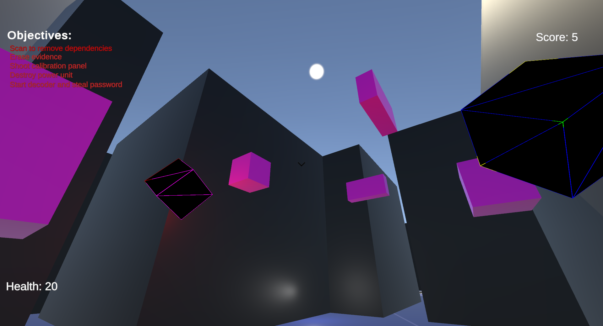
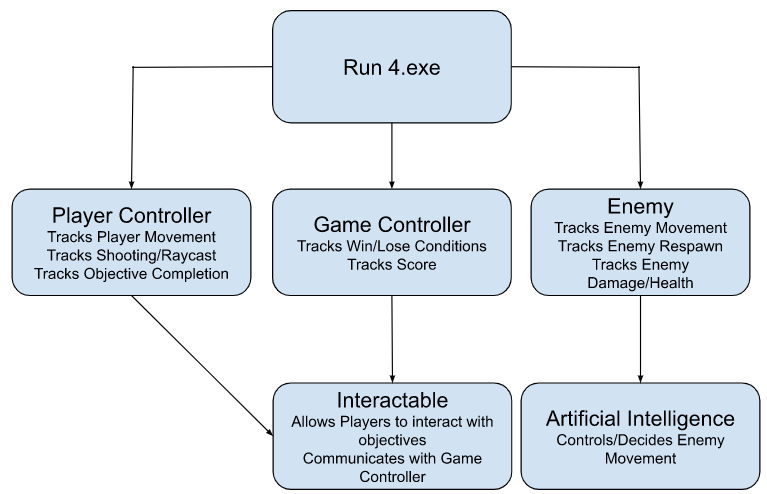

  
  
  
  

    <h1>RUN 4</h1>
    
<h3>Created by Yash Telang, Arthur Wang, Charlie Du, and Alex Wang</h3>

  

  
  

    <a href = "https://docs.google.com/document/d/1IUf3dyW1TnD_ucja0UIhg7Jr_0muf89ayezwk0SF0hw/edit?usp=sharing">Project Proposal</a>
    |
    <a href = "https://docs.google.com/document/d/1tTfg5maTvJ1vPNpdlG3aSTgqO196-tSzHHWcsHte4dg/edit?usp=sharing">Development</a>
    |
    <a href = "https://www.google.com/">Demo</a>
    |
    <a href = "https://docs.google.com/document/d/16Ol95jGr3P_oHxa4LqEG1_2wpmvbBIXkynpoy6MEi_M/edit?usp=sharing">Reach Out</a>
  

  
<h2>Table of Contents</h2>

  <ol>
    <li><a href = "#summary">Summary</a></li>
    <li>
      <a href = "#about-our-project">About Our Project</a>
      <ul>
        <li><a href = "#inspiration">Inspiration</a></li>
        <li><a href = "#technical-architecture">Technical Architecture</a></li>
      </ul>
    </li>
    <li><a href = "#about-us">About Us</a></li>
    <li>
      <a href = "#getting-started">Getting Started</a>
      <ul>
        <li><a href = "#download-instructions">Download Instructions</a></li>
        <li><a href = "#notes-on-gameplay">Notes On Gameplay</a></li>
      </ul>
    </li>
  </ol>

<!--- Summary of presentation introduction --->
## Summary
Our project is an original game called Run 4. Run 4 was built using Unity and is currently a single-player game. There isn't really an alternative to it, as this is an original game inspired by other survival games. In terms of functionality, the player spawns into a maze at the start of the game, and the player must complete all listed objectives before they are killed by enemies (moving blocks). In this ReadMe, we describe our inspiration for creating this project, the technical architecture of Run 4 (i.e, how do all the different components work together?), who we are and our roles in the project, and last but not least, how you can download and start playing Run 4!

<!--- Technical architecture of project --->
## About Our Project
### Inspiration
When determining what kind of project to do, we wanted to choose something that we would not only learn from but was also fun. Run 4 was the perfect choice for this. Most of us did not have much game development experience, so we would learn a lot from creating our first game. Additionally, although Yash, Arthur, and Alex didn't have prior Unity experience, Charlie did. Hence, we felt comfortable taking on this challenge. In the end, we learned a lot about not just how to code a game, but also how to organize and complete a project in a timely fashion (the challenges we ran into are described in more detail in our "Development" link at the top of this page). Meanwhile, this project was super fun because we got to create something that we can share with and enjoy playing with others.

### Technical Architecture

 
  

 

The technical architecture of Run 4 follows the schematic shown above. Run 4 contains five major components: Player Controller, Game Controller, Enemy, Interactables, and Artifical Intelligence. Their respective roles are described in the diagram. Any interaction between components is represented by an arrow. For instance, all three components initally come from running the Run4.exe executable. The Player Controller and Game Controller are connected by the Interactables component. This means that, for instance, when a player completes an objective, the Interactable component receives this message and is able to communicate this with the Game Controller so that the Game Controller can update the player's score. Meanwhile, the Enemy component interacts with the Artificial Intelligence component to control enemy movements and responses. The enemies in Run 4 are moving blocks (more about this in "Getting Started"), and their movement is determined by the Artifical Intelligence component. When the enemy hits the player, Artificial Intelligence communicates this with Enemy so that the player's health can be updated. Similarly, when the player shoots a moving block, Artificial Intelligence communicates to Enemy that the moving block's health should decrease. While coding Run 4, we used C# and various default Unity libraries.

<!--- Group members and their roles --->
## About Us
Yash Telang is a current sophomore majoring in Computer Science at the University of Illinois Urbana-Champaign.  Arthur Telang is a current sophomore majoring in Computer Science at the University of Illinois Urbana-Champaign. Charlie Du is a current sophomore majoring in Computer Science at the University of Illinois Urbana-Champaign. Alex Wang is a current sophomore majoring in Math & Computer Science at the University of Illinois Urbana-Champaign.

During the creation of the project, Yash, Charlie, and Alex initially worked together on player movement and basic environment set-up. In particular, Yash completed  the environment components, and Charlie and Alex completed the player movement components. During this time, Arthur worked on all the modeling-related aspects. This took about 2 to 3 weeks to complete. Afterwards, we split into 2 teams: Yash and Arthur worked on game logic/player objectives while Charlie completed networking.

To prepare for the final project presentation, Yash and Arthur wrote up the development process of our project. Yash and Charlie worked on the presentation script. Arthur completed the technical architecture flowchart. Alex coded and wrote up the ReadMe. Lastly, all four group members worked together to record our project's demo video (which is linked at the top of this page!).

<!--- Provides reproducible installation and running instructions --->
## Getting Started
### Download Instructions
1. Go to [RUN 4](https://drive.google.com/drive/u/1/folders/13qCTqrXj8mvp2V7zyenpdeTcxGncnVcA)
2. Download the zip file (Build.zip)
3. Unzip/extract the zip file's contents and save the contents locally onto your computer
4. To start the game, go to build/Run4.exe and double click on Run4.exe. You should see a pop up screen. *Note that to exit the game, you must click on Alt + tab. This will give your cursor back. If you wish to make the game full-screen, you must click the full-screen option while the program opens and before it starts to run.*

### Notes On GamePlay
- How To Win: Complete all of the objectives before you die.

- Screen
  - Objectives are at the top left (they will turn green once you complete them)
  - Current Health is at the bottom left
  - Score is at top right

- Movement
  - WASD (or arrow keys) + mouse to move
  - Left click on mouse to shoot
  - Space bar to jump
  - Press "e" to interact with challenges
  - Upon a win, press "r" to restart game
  - Upon a loss, simply wait and the game will restart itself

- Interface
  - Enemies are the moving blocks. Everytime a block rams into you, you will lose some health
  - Destroy enemies by shooting them. Killing them will increase your score
  - Destroying one moving blocks will respawn 2 new moving blocks
